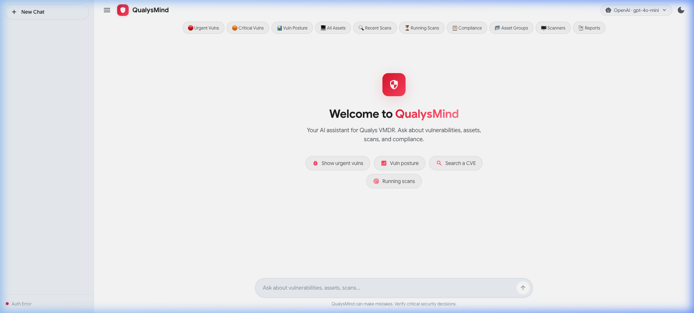
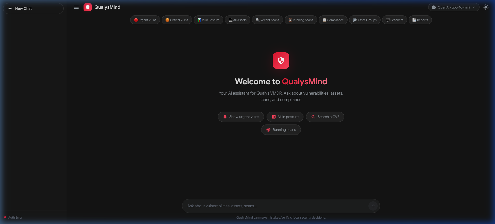
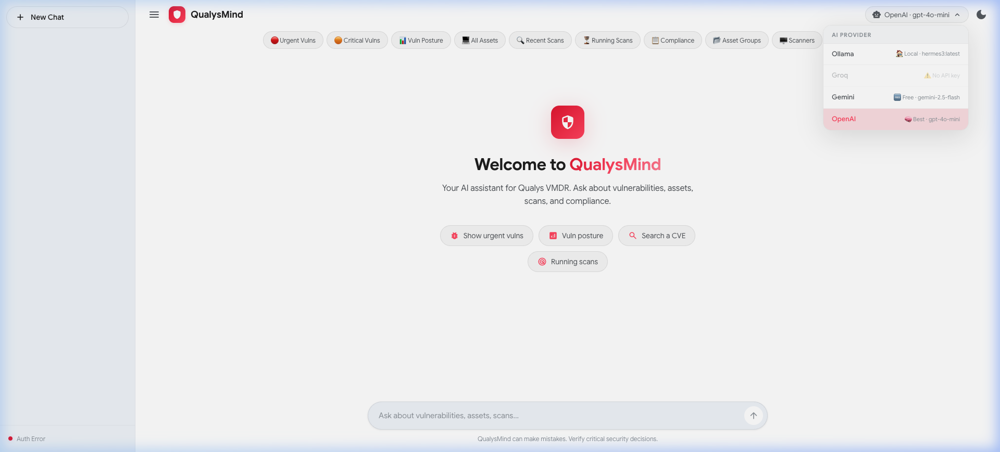

<div align="center">

# 🛡️ QualysMind

### AI-Powered Natural Language Interface for Qualys VMDR

[](https://nodejs.org/)
[](https://expressjs.com/)
[](LICENSE)
[](https://www.qualys.com/)

*Talk to your Qualys VMDR platform in plain English. Query vulnerabilities, manage assets, launch scans, generate reports, and check compliance — all through a conversational AI interface.*

<br>



</div>

---

## ✨ Features

### 🤖 Multi-Provider AI Engine
Switch between AI providers on-the-fly — no server restart needed:
| Provider | Type | Model | Status |
|---|---|---|---|
| **Ollama** | 🏠 Local | hermes3, llama3, etc. | Free, private, no rate limits |
| **Groq** | ⚡ Cloud | compound-mini | Ultra-fast inference |
| **Google Gemini** | 🆓 Cloud | gemini-2.5-flash | Free tier available |
| **OpenAI** | 🧠 Cloud | gpt-4o-mini | Best quality |

### 🔐 Full Qualys VMDR Integration
20 AI-callable functions covering the entire VMDR workflow:

| Category | Operations |
|---|---|
| **Vulnerabilities** | List host detections, search by CVE, posture summary |
| **Knowledge Base** | QID details, KB search by keyword/severity |
| **Assets** | List hosts, asset details, IP ranges |
| **Asset Groups** | List and filter groups |
| **Scans** | List, view results, launch scans, schedules, appliances |
| **Reports** | List, generate, download |
| **Compliance** | Policies, posture data, compliance scans |

### 🎨 Modern Gemini-Style UI
- **Dark / Light theme** — toggle with one click
- **Collapsible sidebar** with New Chat button
- **Material Symbols** icons throughout
- **Suggestion chips** on the welcome screen
- **Quick action buttons** for common VMDR queries
- **Real-time provider switching** via header dropdown
- **Copy button** on every AI response
- **Responsive** — works on desktop and mobile

<details>
<summary>📸 More Screenshots</summary>
<br>

| Dark Mode | Provider Switching |
|---|---|
|  |  |

</details>

### 🔒 Security Features
- **Destructive action confirmation** — scans and reports require explicit approval before execution
- **JWT + Basic Auth** — dual authentication with auto-refresh
- **Rate limiting** — configurable per-endpoint limits
- **Session management** — SQLite-backed sessions
- **No credentials in logs** — sensitive headers stripped automatically

---

## 🏗️ Architecture

```
┌─────────────────────────────────────────────────────────────────┐
│                        Frontend (SPA)                           │
│  index.html · style.css · app.js · modelSelector.js · status.js│
└────────────────────────────┬────────────────────────────────────┘
                             │  HTTP / JSON
┌────────────────────────────▼────────────────────────────────────┐
│                      Express Server                             │
│  ┌──────────┐  ┌──────────┐  ┌──────────┐  ┌──────────────┐   │
│  │ chat.js  │  │ models.js│  │status.js │  │quickActions.js│   │
│  └────┬─────┘  └──────────┘  └──────────┘  └──────────────┘   │
│       │                                                         │
│  ┌────▼─────────────────────────────────────────────────────┐  │
│  │                    AI Factory                             │  │
│  │  Ollama │ Groq │ Gemini │ OpenAI (runtime switchable)    │  │
│  └────┬─────────────────────────────────────────────────────┘  │
│       │  function calls                                         │
│  ┌────▼──────────┐    ┌───────────────────┐                    │
│  │ Intent Router │───▶│ Response Formatter│                    │
│  └────┬──────────┘    └───────────────────┘                    │
│       │                                                         │
│  ┌────▼─────────────────────────────────────────────────────┐  │
│  │               Qualys Service Layer                        │  │
│  │  auth · client · vulnerabilities · assets · scans ·       │  │
│  │  reports · compliance · knowledgeBase · assetGroups        │  │
│  └────┬─────────────────────────────────────────────────────┘  │
│       │                                                         │
│  ┌────▼──────┐  ┌────────────┐  ┌──────────────┐              │
│  │ XML Parser│  │ Rate Limit │  │ Confirmation │              │
│  └───────────┘  └────────────┘  └──────────────┘              │
└────────────────────────────────────────────────────────────────┘
                             │
                    Qualys VMDR API
                 (REST + XML/JSON)
```

### Project Structure

```
qualysmind/
├── server.js                    # Express entry point
├── config/
│   └── index.js                 # Environment config + validation
├── middleware/
│   ├── session.js               # SQLite session store
│   ├── rateLimiter.js           # Per-endpoint rate limiting
│   ├── requestLogger.js         # Morgan request logging
│   └── errorHandler.js          # Global error handler
├── routes/
│   ├── chat.js                  # Main AI chat pipeline
│   ├── models.js                # Provider switching + model listing
│   ├── status.js                # Health check endpoint
│   ├── confirm.js               # Destructive action confirmation
│   └── quickActions.js          # Quick action button definitions
├── services/
│   ├── ai/
│   │   ├── factory.js           # Multi-provider router (runtime switching)
│   │   └── systemPrompt.js      # Qualys VMDR system prompt
│   ├── ollama/chat.js           # Ollama provider
│   ├── groq/chat.js             # Groq provider
│   ├── gemini/
│   │   ├── chat.js              # Gemini provider (OpenAI fallback)
│   │   └── functions.js         # Gemini function format converter
│   ├── openai/
│   │   ├── chat.js              # OpenAI provider
│   │   └── functions.js         # 20 function definitions
│   └── qualys/
│       ├── auth.js              # JWT + Basic Auth manager
│       ├── client.js            # Axios client (XML auto-parse)
│       ├── xmlParser.js         # fast-xml-parser wrapper
│       ├── vulnerabilities.js   # Host detections, CVE search
│       ├── knowledgeBase.js     # QID lookup, KB search
│       ├── assets.js            # Host management
│       ├── assetGroups.js       # Asset group operations
│       ├── scans.js             # Scan management + launch
│       ├── reports.js           # Report generation + download
│       └── compliance.js        # Policy + posture data
├── utils/
│   ├── intentRouter.js          # Maps AI calls → Qualys services
│   ├── responseFormatter.js     # API results → Markdown tables
│   ├── confirmationStore.js     # In-memory confirmation tokens
│   └── summarizationPrompt.js   # Context summarization
└── public/
    ├── index.html               # SPA entry point
    ├── css/style.css            # Gemini-style dark/light theme
    └── js/
        ├── app.js               # Chat logic, sidebar, theme
        ├── modelSelector.js     # Provider switching dropdown
        ├── status.js            # Connection status indicator
        ├── quickActions.js      # Quick action bar
        ├── avatars.js           # Avatar rendering
        └── markdown.js          # Markdown renderer config
```

---

## 🚀 Quick Start

### Prerequisites
- **Node.js 18+** — [Download](https://nodejs.org/)
- **Qualys VMDR account** with API access
- At least one AI provider:
  - [Ollama](https://ollama.ai/) (recommended — free, local, private)
  - [Groq API key](https://console.groq.com/keys) (free tier)
  - [Gemini API key](https://aistudio.google.com/app/apikey) (free tier)
  - [OpenAI API key](https://platform.openai.com/api-keys) (paid)

### Installation

```bash
# Clone the repository
git clone https://github.com/yourusername/qualysmind.git
cd qualysmind

# Install dependencies
npm install

# Configure environment
cp .env.example .env
# Edit .env with your Qualys credentials and AI provider key(s)
```

### Configuration

Edit `.env` with your credentials:

```env
# Required — Qualys VMDR API
QUALYS_USERNAME=your_username
QUALYS_PASSWORD=your_password
QUALYS_BASE_URL=https://qualysapi.qualys.com        # Your Qualys platform URL
QUALYS_GATEWAY_URL=https://gateway.qg1.apps.qualys.com

# Choose your AI provider (ollama, groq, gemini, openai)
AI_PROVIDER=ollama

# For Ollama (recommended — free & private)
OLLAMA_MODEL=hermes3:latest
OLLAMA_BASE_URL=http://localhost:11435/v1
```

<details>
<summary>📋 Qualys Platform URLs</summary>

| Platform | API Base URL | Gateway URL |
|---|---|---|
| US-1 | `https://qualysapi.qualys.com` | `https://gateway.qg1.apps.qualys.com` |
| US-2 | `https://qualysapi.qg2.apps.qualys.com` | `https://gateway.qg2.apps.qualys.com` |
| US-3 | `https://qualysapi.qg3.apps.qualys.com` | `https://gateway.qg3.apps.qualys.com` |
| EU-1 | `https://qualysapi.qualys.eu` | `https://gateway.qg1.apps.qualys.eu` |
| EU-2 | `https://qualysapi.qg2.apps.qualys.eu` | `https://gateway.qg2.apps.qualys.eu` |
| India | `https://qualysapi.qg1.apps.qualys.in` | `https://gateway.qg1.apps.qualys.in` |

</details>

### Run

```bash
# Production
npm start

# Development (with auto-reload)
npm run dev
```

Open **http://localhost:3000** and start chatting!

---

## 💬 Example Queries

| Query | What it does |
|---|---|
| `Show me all critical vulnerabilities` | Lists host detections with severity 5 |
| `Search for CVE-2024-3094` | Finds all hosts affected by a specific CVE |
| `What's our vulnerability posture?` | Summary of severities across all assets |
| `List all assets in US region` | Queries hosts with location filters |
| `Launch a scan on 10.0.0.0/24` | ⚠️ Confirms, then starts a vulnerability scan |
| `Generate a report for last week's scan` | ⚠️ Confirms, then creates a report |
| `Show compliance policy status` | Lists compliance policies and their posture |
| `What scans are currently running?` | Shows active scan status |

> ⚠️ Queries that trigger scans or report generation will ask for confirmation before executing.

---

## 🔌 AI Provider Switching

Switch providers directly from the UI — no restart required:

1. Click the **provider badge** in the top-right header
2. Select any configured provider from the dropdown
3. The AI engine switches instantly

You can also switch via API:

```bash
# Switch provider
curl -X POST http://localhost:3000/api/models/provider \
  -H "Content-Type: application/json" \
  -d '{"provider": "ollama"}'

# Switch Ollama model
curl -X POST http://localhost:3000/api/models/switch \
  -H "Content-Type: application/json" \
  -d '{"model": "llama3:latest"}'
```

---

## 🧪 Testing

```bash
# Run all tests
npm test

# Run with coverage
npm run test:coverage
```

---

## 📦 Tech Stack

| Technology | Purpose |
|---|---|
| **Node.js + Express** | Backend server |
| **Axios** | HTTP client for Qualys API |
| **fast-xml-parser** | XML → JSON conversion (Qualys v2 APIs) |
| **OpenAI SDK** | OpenAI + Groq + Ollama providers |
| **@google/generative-ai** | Google Gemini provider |
| **express-session + SQLite** | Session management |
| **express-rate-limit** | API rate limiting |
| **Marked.js** | Markdown rendering in chat |
| **Material Symbols** | Google icon system |

---

## 🗺️ Roadmap

- [ ] Conversation history persistence
- [ ] Multi-user authentication
- [ ] Real-time streaming responses
- [ ] Dashboard with vulnerability charts
- [ ] Webhook integrations for alerts
- [ ] Docker deployment
- [ ] Automated remediation workflows

---

## 📄 License

This project is licensed under the MIT License — see the [LICENSE](LICENSE) file for details.

---

<div align="center">

**Built with ❤️ for security teams who deserve better tools.**

[Report Bug](issues) · [Request Feature](issues)

</div>
